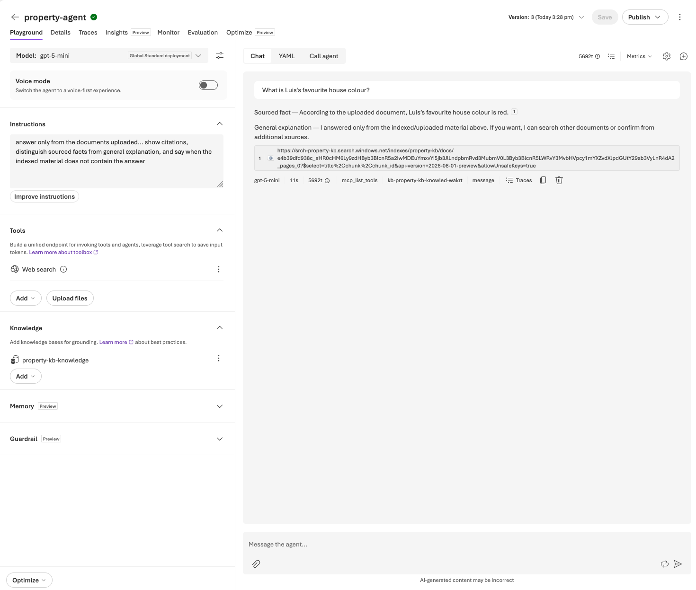
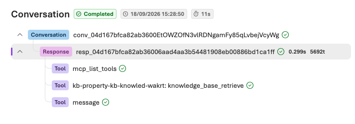
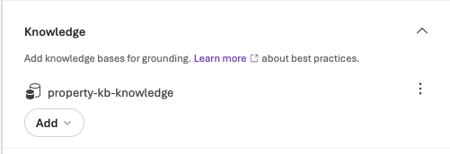

# Learning Plan Status

Progress against [02-getting-started-plan.md](02-getting-started-plan.md).

- [x] **Step 0 — Prereqs**: Azure CLI installed, logged in
- [x] **Step 1 — Gather documents**: 4 public UK property PDFs downloaded and uploaded to Blob Storage
- [x] **Step 2 — Create resources**: resource group, storage account + container, Azure AI Search service (`srch-property-kb`), Foundry chat deployment (`gpt-5-mini`) and embedding deployment (`text-embedding-3-small`) — all created and tested individually, plus a working mini RAG loop built by hand to prove the concept
- [x] **Step 3 — Index the documents**: `property-kb` index built via the "Import and vectorize data" wizard — 390 chunks across the 4 PDFs, 0 failures. Hit a real snag along the way — see [04-indexing-fix-notes.md](04-indexing-fix-notes.md)
- [x] **Step 4 — Connect to Foundry**: created a Foundry Agent (`property-agent`, `gpt-5-mini`), created a Foundry IQ knowledge base (`property-kb-knowledge`) pointed at the `property-kb` index (API key auth), attached it to the agent under Knowledge
- [x] **Step 5 — Test**: asked the agent "What is the difference between leasehold and freehold, and what should a buyer check before purchasing a leasehold property?" — got a fully grounded, UK-specific answer with 31 numbered inline citations linking back to exact chunks in `property-kb`, plus a "Jurisdiction note" flagging the cited documents are UK-focused. Discovered agentic retrieval doesn't always call the knowledge base by default — a vague personal-sounding question ("What is Luis's favourite house colour?") got answered straight from the model with zero retrieval (confirmed via Traces: no `kb-property-kb-knowledge` tool call). Fixed by rewriting the agent's Instructions to force a knowledge-base search on every question and require explicit "not found" behaviour. Re-tested the same question after uploading a one-line test document (`luis-favourite-colour.txt`, re-indexed → 391 chunks) and got a correctly sourced, cited answer with a clear "Sourced fact" vs "General explanation" split. Confirms citations, sourced-vs-general distinction, and controllable retrieval behaviour all work as specified. Verified via Traces: the retrieval call now shows as its own explicit tool step, `kb-property-kb-knowled-wakrt: knowledge_base_retrieve`, alongside `mcp_list_tools` and `message` — visible, provable evidence the agent actually queried the index rather than answering from the model.

  
  
  

  Ran two more representative questions. "Compare the reported considerations for flats and houses" produced a fully structured, cited comparison (tenure prevalence, recurring costs, statutory rights, buying considerations, market/reform context), each claim tagged with a specific `【source†document.pdf】` citation — a clean pass.

  "What is the average mortgage interest rate in Japan?" (deliberately unanswerable from the indexed UK documents) correctly avoided hallucinating a number, but did not meet spec exactly — it framed the gap as "no live web lookup available" rather than the required explicit "not found in the supplied sources." Documented as a known limitation rather than fixed; a further instructions tweak (distinguish "not in knowledge base" from "no live web access") would close it, deferred as out of scope for the one-day prototype.
- [x] **Step 6 — Notes**: see [05-learning-outcomes.md](05-learning-outcomes.md)

## Resources created

| Resource | Name | Notes |
|---|---|---|
| Resource group | rg-property-kb | uksouth |
| Storage account | stpropertykb001 | container: `property-docs` |
| Azure AI Search | srch-property-kb | Basic tier, uksouth |
| Foundry resource | luisjlop-1485-resource | swedencentral, kind AIServices — hosts chat deployment |
| Chat deployment | gpt-5-mini | on luisjlop-1485-resource |
| OpenAI resource | property-kb-openai | uksouth, kind OpenAI — hosts embedding deployment used by the Search indexer |
| Embedding deployment | text-embedding-3-small | on property-kb-openai, 1536 dimensions |
| Search index | property-kb | 390 chunks indexed from the 4 PDFs |
| Foundry knowledge base | property-kb-knowledge | Foundry IQ, output mode: Extractive data, connected to property-kb via API key |
| Foundry agent | property-agent | gpt-5-mini + property-kb-knowledge attached |

## Repo layout

- [scripts/](scripts/) — uv project, `upload_docs.py` downloads + uploads the source PDFs
- [foundry_scripts/](foundry_scripts/) — uv project, `chat.py` / `embed.py` sanity-check the two deployments, `mini_rag_demo.py` is a hand-rolled RAG loop (embed → cosine similarity retrieval → generate) proving the concept before the real Search index exists
