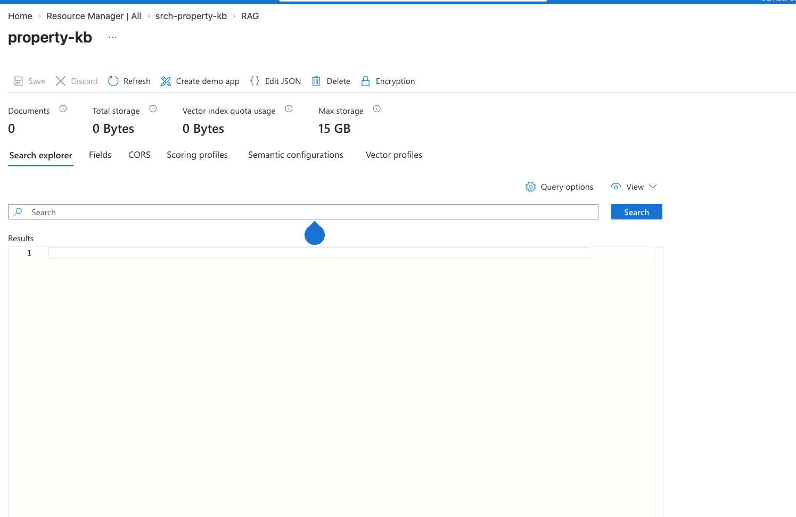

# Personal Notes

## Install Azure CLI

```
brew update && brew install azure-cli

az login
```

<!-- validate by running: -->
```
az account show
```

## Create infrastructure

```
az group create --name rg-property-kb --location uksouth
```

```
az storage account create \
  --name stpropertykb001 \
  --resource-group rg-property-kb \
  --location uksouth \
  --sku Standard_LRS \
  --kind StorageV2

az storage container create \
  --account-name stpropertykb001 \
  --name property-docs \
  --auth-mode login
```

<!-- create Azure AI Search service -->
```
az search service create \
  --name srch-property-kb \
  --resource-group rg-property-kb \
  --location uksouth \
  --sku basic
```

## Status: up and running

- Resource group: rg-property-kb (uksouth)
- Storage account: stpropertykb001, container property-docs
- Azure AI Search: srch-property-kb — endpoint https://srch-property-kb.search.windows.net, status running

## Next steps

Now — Step 2 (remaining part): create the Foundry project + two model deployments

- A chat model deployment (you already have gpt-5-mini deployed — reusable)
- An embedding model deployment (e.g. text-embedding-3-small) — this is new, and it's what turns your document text into vectors

Then — Step 3: index the documents

- Use the Azure AI Search "Import and vectorize data" wizard in the Azure Portal, pointed at your property-docs container, using the new embedding deployment. This auto-builds chunking + the vector index — no pipeline code needed.

Then — Step 4: connect the index to Foundry so your chat model retrieves from it (this is what gives you citations and grounded answers, unlike the plain chat test you just ran).

Let's do the embedding deployment first. Do you already have a Foundry resource/project (the same one your gpt-5-mini deployment lives in — luisjlop-1485-resource), or do you want me to check what's there via CLI first?

## RBAC fixes

```
az search service update \
  --name srch-property-kb \
  --resource-group rg-property-kb \
  --identity-type SystemAssigned
```

```
az role assignment create \
  --assignee "<search-service-managed-identity-principal-id>" \
  --role "Storage Blob Data Reader" \
  --scope "/subscriptions/<subscription-id>/resourceGroups/rg-property-kb/providers/Microsoft.Storage/storageAccounts/stpropertykb001"
```

## Screenshot


